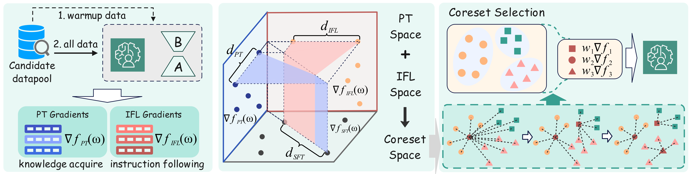

# MINT 🌿: Multi-Constrained Coreset Selection for Efficient Instruction Tuning in LLMs

This repository contains the official implementation of the paper **"MINT: Multi-Constrained Coreset Selection for Efficient Instruction Tuning in LLMs"**.

## 📋 Overview

MINT is a coreset selection framework that efficiently selects a coreset of instruction examples for training large language models (LLMs). By decomposing the training loss into knowledge-related and instruction-following components, MINT achieves similar model performance to using the full instruction dataset while reducing computational costs.

The key insight is that different instruction examples contribute differently to two fundamental LLM capabilities: **knowledge-related capability** (factual correctness) and **instruction-following capability** (understanding and following diverse instructions). MINT addresses this by formulating a dual-constraint optimization problem that balances these two capabilities when selecting the coreset, ensuring that the selected subset preserves instruction-following ability without sacrificing the model's existing knowledge.



### ✨ Key Features

- **Theoretical Foundation**: Decomposes instruction tuning loss into knowledge-related and instruction-following capabilities with theoretical guarantees
- **Dual-Constraint Optimization**: Balances knowledge-related capability and instruction-following capability through a principled trade-off mechanism
- **Efficient Selection**: Uses submodular optimization with bounded approximation error, reducing the dual-constraint problem to a tractable single-constraint formulation
- **General Applicability**: Works across different model architectures and datasets

## 📦 Requirements

Install the required dependencies:

```bash
pip install -r requirements.txt
```


## 🚀 Quick Start

The main pipeline consists of 4 steps, all orchestrated through scripts in the `script/` directory:

### 🔧 Step 0: Configuration

First, configure the pipeline by editing `script/MINT_config.sh`:

```bash
cd script/
vim MINT_config.sh
```

Key configuration parameters:
- `DATA_FILE`: Path to your instruction tuning dataset (JSON format)
- `MODEL_TRAIN_PATH`: Path to the base model (e.g., LLaMA-3-8B)
- `SAMPLE_RATIO`: Ratio for warm-up training (default: 0.05)
- `RATIOS_LIST`: List of coreset ratios to generate (default: `0.05 0.10 0.15`)
- `TRAIN_RATIO`: Final coreset ratio for training (default: 0.05)
- `DIM`: Gradient projection dimension (default: 8192)
- `SEED`: Random seed for reproducibility

### 🔥 Step 1: Warm-up Training

Perform initial training on a small subset to get a warm-up model:

```bash
bash step1_warm_up.sh
```

This step:
- Trains a LoRA adapter on a small sample of the dataset
- Creates a checkpoint that will be used for gradient computation
- Outputs model to `output/model/{JOB_NAME_WARM}/`

### 📊 Step 2: Gradient Extraction

Compute gradients using the warm-up model:

```bash
bash step2_get_gradients.sh
```

This step:
- Uses the warm-up model to compute gradients for all training examples
- Extracts both knowledge-related (PT) and instruction-following (IFL) gradients
- Saves gradient representations to `output/grads/{JOB_NAME_WARM}/`

### 🎯 Step 3: MINT Coreset Selection

Run the MINT algorithm to select the optimal coreset:

```bash
bash step3_MINT.sh
```

This step:
- Loads gradient representations from Step 2
- Applies the MINT algorithm with dual-constraint optimization
- Automatically determines optimal α parameter through plateau detection
- Generates coreset files with different subset ratios
- Outputs to `output/coreset/` with visualization plots

### 🏆 Step 4: Final Training

Train the final model using the selected coreset:

```bash
bash step4_train.sh
```

This step:
- Loads the coreset from Step 3
- Trains the model with weighted sampling based on MINT selection
- Outputs the final trained model to `output/model/{JOB_NAME_FINAL}/`

## 🔄 Pipeline Overview

```
Data → [Step 1: Warm-up] → [Step 2: Gradients] → [Step 3: MINT] → [Step 4: Final Training] → Trained Model
```

## ⚙️ Configuration Details

### 📁 Dataset Format

Your instruction dataset should be in JSON format with the following structure:

```json
[
  {
    "instruction": "Your instruction here",
    "input": "Optional input context",
    "output": "Expected response"
  },
  ...
]
```

### 🤖 Model Support

MINT supports various model architectures:
- LLaMA/LLaMA-2/LLaMA-3 series
- Mistral models
- Other causal language models compatible with Transformers

### 🔧 Training Configuration

Key training parameters can be modified in `mint/scripts/base_training_args.sh`:
- Learning rate: `2e-05`
- Batch size: `1` (with gradient accumulation: `32`)
- LoRA rank: `128`
- Training epochs: `4`

## 📂 Output Structure

After running the full pipeline, your output directory will contain:

```
output/
├── model/
│   ├── {JOB_NAME_WARM}/          # Warm-up model
│   └── {JOB_NAME_FINAL}/         # Final trained model
├── grads/
│   └── {JOB_NAME_WARM}/          # Gradient representations
└── coreset/
    ├── {DIM}_{JOB_NAME_WARM}_{RATIOS_LIST}.npz # Coreset files for different ratios
    ├── {DIM}_{JOB_NAME_WARM}_errors.csv        # Error analysis
    ├── {DIM}_{JOB_NAME_WARM}_pareto.png        # Pareto frontier plot
    └── {DIM}_{JOB_NAME_WARM}_plateau.png       # Plateau detection plot
```

## 🔬 Advanced Usage

### 🎛️ Manual α Parameter

Instead of automatic α detection, you can specify a manual α value:

```bash
# Edit MINT_config.sh
ALPHA=0.10
ALPHA_OPT="--alpha ${ALPHA}"
```

### 🎨 Custom Coefficients

For advanced users, you can specify custom coefficients for SFT, PT, and IFL components:

```bash
python mint/coreset/run_MINT.py \
    --grad-dir output/grads/{MODEL_NAME}/ \
    --proj-dim 8192 \
    --subset-ratio 0.15 \
    --coef 0.0 1.0 2.0 \  # SFT, PT, IFL coefficients
    --save output/coreset/custom_coreset
```

### 📏 Different Subset Ratios

The pipeline automatically generates coresets with different ratios (5%, 10%, 15%). You can modify `SUBSET_RATIO` in the config to change the primary ratio used for final training.

## 📈 Evaluation

To evaluate your trained model, you can use standard benchmarks or your custom evaluation pipeline. The trained models are compatible with standard Transformers evaluation frameworks.


## 📝 Logs

All training logs are saved to the `log/` directory with descriptive filenames based on job names.

## 📖 Citation

If you use MINT in your research, please cite our paper:

```bibtex
@article{mint2024,
  title={MINT: Multi-Constrained Coreset Selection for Efficient Instruction Tuning in LLMs},
  author={[Author Names]},
  journal={[Conference/Journal]},
  year={2024}
}
```

## 📄 License

This project is licensed under the MIT License - see the [LICENSE](LICENSE) file for details.


## 🙏 Acknowledgments

We thank the open-source community for providing the foundational tools and datasets that made this work possible.

This work builds upon and references the following projects:
- **LESS** (LESS: Selecting Influential Data for Targeted Instruction Tuning): https://github.com/princeton-nlp/LESS
- **CRAIG** (Data-efficient Training of Machine Learning Models): https://github.com/baharanm/craig

We appreciate the authors of these projects for making their code and methodologies publicly available.